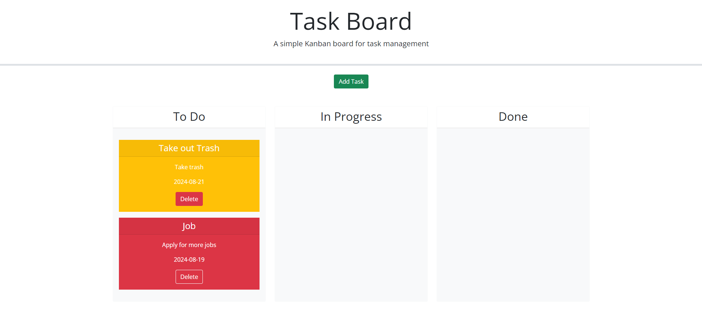

# TaskBoard

A simple taskboard application made to put in a list of todos for yourself. You can easily put in the date and write a quick description of what you need to do. The color of the cards change based on when the due date is. You can also deleted tasks if you made a mistake easily.

Screenshots:

Links:

Github Repository Link: https://github.com/JPhanvilay/TaskBoard

Deployed Link:
